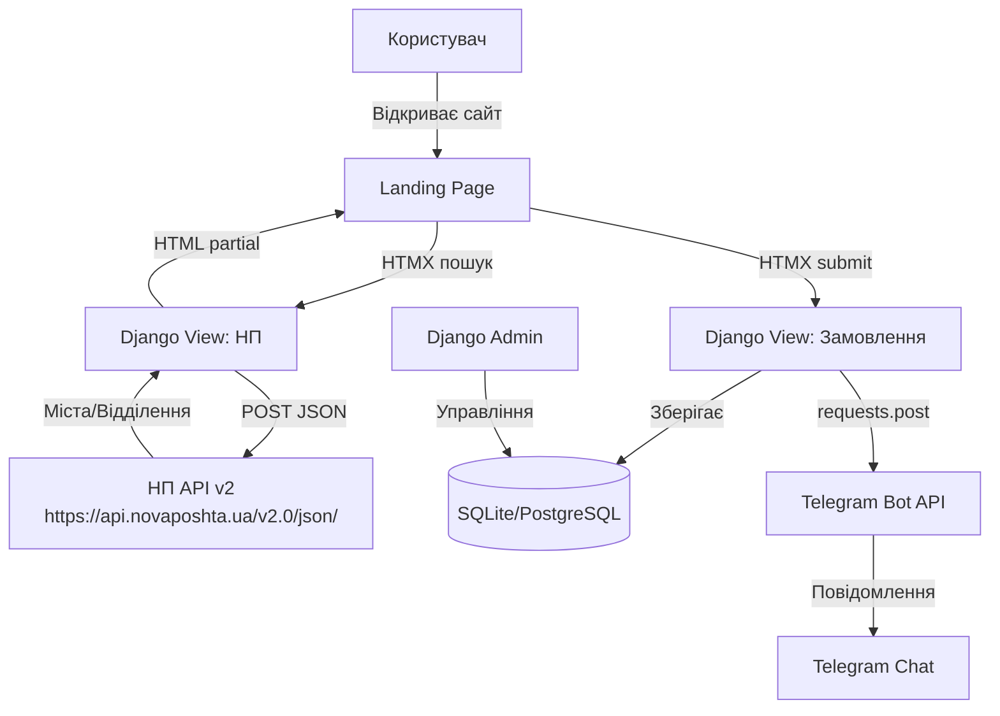

# Lorento - Лендінг продажу жіночого взуття

## Стек

- **Backend:** Django 5.x, python-dotenv
- **Frontend:** HTML5, CSS3 (mobile-first), HTMX 2.x, vanilla JS
- **API:** Nova Poshta API v2 (пошук міст/відділень), Telegram Bot API (requests)
- **БД:** SQLite (dev) -> PostgreSQL (prod-ready settings)

## Архітектура




## Структура проєкту

```
Lorento/
├── manage.py
├── requirements.txt
├── .env.example
├── lorento/                    # Django project config
│   ├── settings.py
│   ├── urls.py
│   └── wsgi.py
├── shop/                       # Main app
│   ├── models.py               # Order, ShoeColor
│   ├── admin.py                # OrderAdmin
│   ├── views.py                # landing, create_order
│   ├── urls.py
│   ├── forms.py                # OrderForm
│   ├── services/
│   │   ├── novaposhta.py       # search_cities, search_warehouses
│   │   └── telegram.py         # send_order_notification
│   ├── templates/shop/
│   │   ├── base.html
│   │   ├── landing.html
│   │   └── partials/
│   │       ├── order_form.html
│   │       ├── city_results.html
│   │       ├── warehouse_results.html
│   │       └── order_success.html
│   └── static/shop/
│       ├── css/
│       │   ├── vars.css        # CSS variables, ivory palette
│       │   ├── base.css        # Reset, typography, mobile-first
│       │   ├── landing.css     # Organic layout, absolute images
│       │   └── form.css        # Order form styles
│       ├── js/
│       │   └── main.js         # Debounce, form logic
│       └── img/                # Placeholder shoe images
```

## Дизайн-концепція

- **Фон:** слонова кістка `#FFFFF0` з м'якими акцентами
- **Без блоків:** Flowing organic layout - текст і зображення "плавають" по сторінці через `position: absolute/relative`, `transform`, `z-index`
- **Mobile-first:** Базові стилі для 320px+, media queries для 768px+ та 1024px+
- **Шрифти:** Serif для заголовків (елегантність), sans-serif для тексту
- **Зображення:** Абсолютне позиціонування, overflow hidden, м'які тіні

## Модель даних

**ShoeColor** - кольори моделі взуття:

- `name` (CharField) - назва кольору
- `hex_code` (CharField) - HEX колір
- `image` (ImageField) - фото
- `is_available` (BooleanField)

**Order** - замовлення:

- `name` (CharField)
- `phone` (CharField)
- `shoe_color` (FK -> ShoeColor)
- `size` (CharField)
- `city_name` (CharField)
- `city_ref` (CharField) - Ref НП
- `warehouse_name` (CharField)
- `warehouse_ref` (CharField) - Ref НП
- `comment` (TextField, optional)
- `status` (CharField choices: new/processing/shipped/delivered)
- `created_at` (DateTimeField)

## Інтеграція Нова Пошта

Використовуємо **API v2** (`https://api.novaposhta.ua/v2.0/json/`):

- `Address.searchSettlements` - пошук міст (HTMX autocomplete, debounce 300ms)
- `Address.getWarehouses` - отримання відділень по обраному місту

Приклад запиту:

```python
{
    "apiKey": NP_API_KEY,
    "modelName": "Address",
    "calledMethod": "searchSettlements",
    "methodProperties": {"CityName": query, "Limit": "10"}
}
```

## Telegram

Пряме HTTP через `requests`:

```python
requests.post(
    f"https://api.telegram.org/bot{BOT_TOKEN}/sendMessage",
    json={"chat_id": CHAT_ID, "text": message, "parse_mode": "HTML"}
)
```

## .env конфігурація

```
SECRET_KEY=...
DEBUG=True
NP_API_KEY=your_nova_poshta_api_key
TELEGRAM_BOT_TOKEN=your_bot_token
TELEGRAM_CHAT_ID=your_chat_id
```

## HTMX взаємодія

- Пошук міста: `hx-post="/api/np/cities/"` з `hx-trigger="keyup changed delay:300ms"`
- Пошук відділень: `hx-post="/api/np/warehouses/"` з `hx-trigger="change"`
- Відправка замовлення: `hx-post="/order/"` з `hx-swap="outerHTML"` -> показ success partial

## Cross-platform

- CSS: `-webkit-` prefixes, `env(safe-area-inset-*)` для iOS notch
- Touch: `touch-action`, `-webkit-tap-highlight-color`
- Viewport: `<meta name="viewport" content="width=device-width, initial-scale=1, viewport-fit=cover">`
- Font smoothing: `-webkit-font-smoothing: antialiased`
- Scroll

